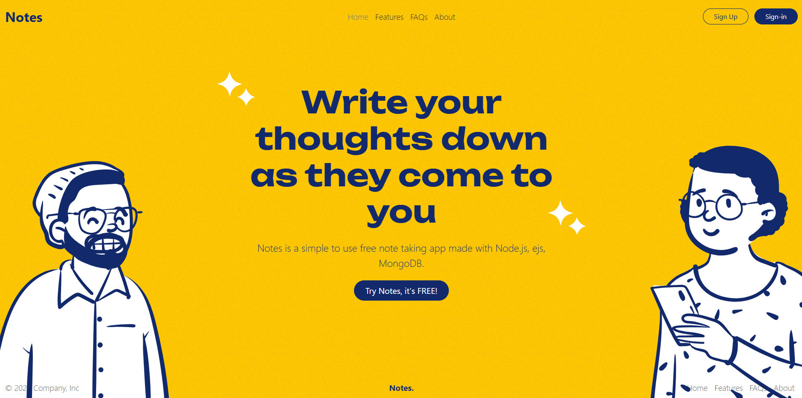
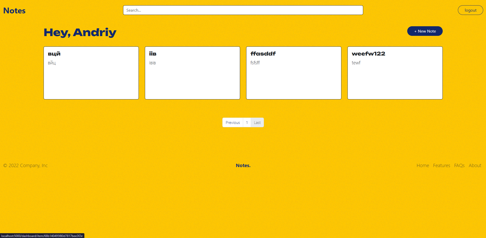
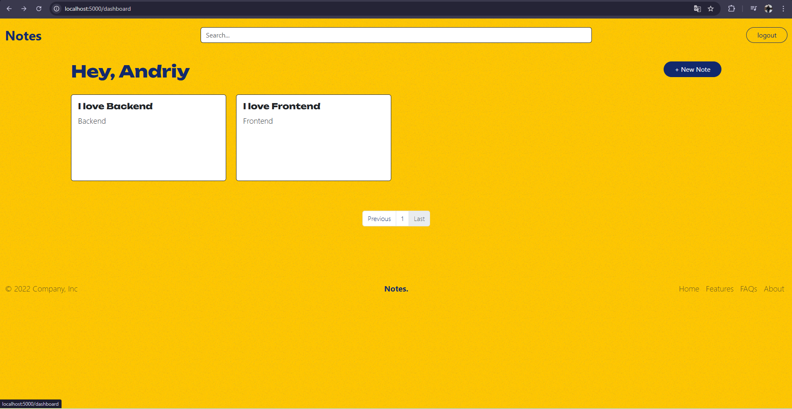
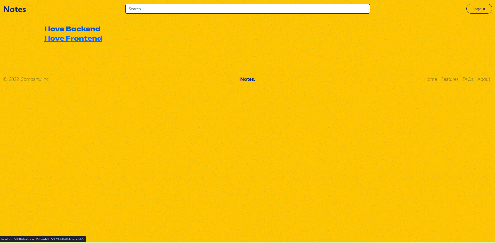
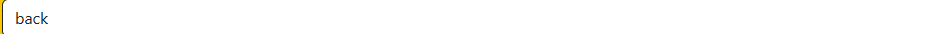
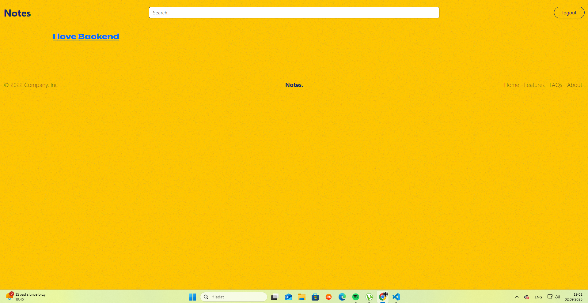
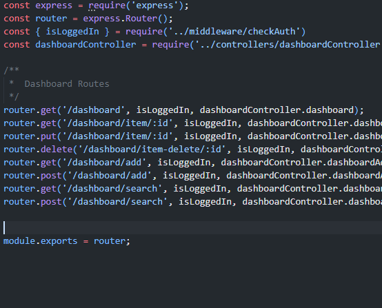

# 📝 Notes App

A modern web application for creating and managing notes with Google OAuth authorization.

## 🚀 Features

✅ **Google OAuth 2.0** - Secure authorization via Google account  
✅ **CRUD operations** - Create, read, edit, and delete notes  
✅ **Note search** - Quick search by title and content  
✅ **Pagination** - Convenient display of large numbers of notes  
✅ **Responsive design** - Adaptive interface for all devices  
✅ **Personal notes** - Each user sees only their own notes  

## 🛠 Technology Stack

**Backend:**
- **Node.js** - Server-side runtime environment
- **Express.js** - Web framework
- **MongoDB** - Database
- **Mongoose** - ODM for MongoDB
- **Passport.js** - Authentication system
- **Express Session** - Session management

**Frontend:**
- **EJS** - Template engine
- **Bootstrap 5** - CSS framework
- **Custom CSS** - Additional styles

## 📋 Prerequisites

Before installing, make sure you have the following installed:

- [Node.js](https://nodejs.org/) (version 14.x or higher)
- [MongoDB](https://www.mongodb.com/) or a MongoDB Atlas account
- A Google Developer Console account for OAuth

## ⚙️ Installation and Launch

### 1. Cloning the repository
```bash
git clone https://github.com/yourusername/notes-app.git
cd notes-app
```

### 2. Installing dependencies
```bash
npm install
```

### 3. Setting environment variables
Create a `.env` file in the root folder of your project:

```env
# Database
MONGODB_URI=your_mongodb_connection_string

# Google OAuth
GOOGLE_CLIENT_ID=your_google_client_id
GOOGLE_CLIENT_SECRET=your_google_client_secret
GOOGLE_CALLBACK_URL=http://localhost:5000/google/callback

# Application Port
PORT=5000

# Development Mode
NODE_ENV=development
```

### 4. Setting up Google OAuth

1. Go to [Google Cloud Console](https://console.cloud.google.com/)
2. Create a new project or select an existing one
3. Enable Google+ API
4. Go to "Credentials" → "Create Credentials" → "OAuth client ID"
5. Select "Web application"
6. Add authorized URLs:
   - **Authorized JavaScript origins:** `http://localhost:5000`
   - **Authorized redirect URIs:** `http://localhost:5000/google/callback`

### 5. Launching the application

**Development mode:**
```bash
npm start
```

**Production mode:**
```bash
npm run start:prod
```

The application will be available at: `http://localhost:5000`

## 📁 Project Structure

```
notes-app/
├── public/                 # Static files
│   ├── css/
│   │   └── main.css       # Main styles
│   └── img/               # Images
├── server/
│   ├── config/
│   │   └── db.js          # Database settings
│   ├── controllers/       # Controllers
│   │   ├── dashboardController.js
│   │   └── mainController.js
│   ├── middleware/        # Middleware functions
│   │   └── checkAuth.js
│   ├── Models/            # Data models
│   │   ├── Notes.js
│   │   └── User.js
│   └── routes/            # Routes
│       ├── auth.js
│       ├── dashboard.js
│       └── index.js
├── views/                 # EJS templates
│   ├── layouts/
│   ├── partials/
│   └── dashboard/
├── app.js                 # Main application file
├── package.json
└── README.md
```

## 🔥 What the code does app.js:

1. **📦 Loads libraries** - Express, Passport, MongoDB, etc.
2. **🔐 Configures sessions** - for authorization via Google
3. **⚙️ Connects middleware** - form processing, JSON, static files
4. **🎨 Configures EJS** - templates for web pages
5. **📊 Connects to MongoDB** - database
6. **🛣 Connects routes** - website pages
7. **❌ Handles 404** - non-existent pages
8. **🚀 Starts the server** - on port 5000

## 🔧 API Endpoints

### 🔐 Authentication
- `GET /auth/google` → redirects to Google for login
- `GET /google/callback` → Google returns here after authorization
  - **Success** → `/dashboard`
  - **Error** → `/login-failure`
- `GET /logout` → destroys session and redirects to home

### 📝 Notes (requires authorization)

**Main Dashboard:**
 -> for unauthorized user 
 -> for autorized user
- `GET /dashboard` - Main page with notes

**Creating Notes:**
 -> for post just write some text and click add
- `GET /dashboard/add` - Form for creating a note
- `POST /dashboard/add` - Create a new note *(just write some text and click + Add Note)*

**Managing Notes:**
 -> differences between dashboard/add that are in the form of text here we have some text cuz we click on specific object
- `GET /dashboard/item/:id` - View/edit a note *(form with existing text)*
- `PUT /dashboard/item/:id` - Update a note *(click update button)*
- `DELETE /dashboard/item-delete/:id` - Delete note

**Search Functionality:**






- `GET /dashboard/search` - Search page
- `POST /dashboard/search` - Search notes

### 🛡️ Middleware Protection

**File:** `server/middleware/checkAuth.js`

```javascript
exports.isLoggedIn = function (req, res, next) {
    if(req.user){
        next() // ✅ User is logged in → continue
    }else{
        return res.status(401).send('Access Denied') // ❌ No access
    }
}
```

**Usage in routes:** Import `isLoggedIn` and use it on every protected endpoint. -> routes -> dashboard.js -> u can wee import isLoggedIn and use on every point 


## 🎨 UI/UX Features

- 🎨 **Modern design** with custom color scheme
- 🎭 **Animated SVG illustrations** to enhance user experience
- 📱 **Responsive grid** for displaying notes
- 🪟 **Modal windows** for deletion confirmation
- 🧭 **Breadcrumb navigation** for easy navigation
- 📄 **Pagination** with smart page display

## 🔒 Security

- 🔐 **OAuth 2.0** authentication via Google
- 💾 **Secure storage** sessions in MongoDB
- 🛡️ **Authorization checks** on all secure routes
- ✅ **Server-side data validation**
- 👤 **User isolation** — each user can only see their own notes

## 🚀 Deploy

### MongoDB Atlas
For production environments, we recommend using MongoDB Atlas:

1. Create a cluster in MongoDB Atlas
2. Get the connection string
3. Update `MONGODB_URI` in the environment variables

### Render Deployment
This app is optimized for deployment on Render platform.

## 📄 License

This project is licensed under the MIT License - see the [LICENSE](LICENSE) file for details.

## 👥 Author

**Andriy Simchera** - [GitHub](https://github.com/metisssi)

---

