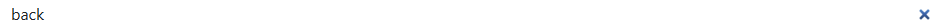

📝 Notes App
A modern web application for creating and managing notes with Google OAuth authorization.

🚀 Features

✅ Google OAuth 2.0 - Secure authorization via Google account
✅ CRUD operations - Create, read, edit, and delete notes
✅ Note search - Quick search by title and content
✅ Pagination - Convenient display of large numbers of notes
✅ Responsive design - Adaptive interface for all devices
✅ Personal notes - Each user sees only their own notes

🛠 Technology stack
Backend:

Node.js - Server-side runtime environment
Express.js - Web framework
MongoDB - Database
Mongoose - ODM for MongoDB
Passport.js - Authentication system
Express Session - Session management

Frontend:

EJS - Template engine
Bootstrap 5 - CSS framework
Custom CSS - Additional styles

🚀 Deploy

    Render -> 

📋 Prerequisites
Before installing, make sure you have the following installed:

Node.js (version 14.x or higher)
MongoDB or a MongoDB Atlas account
A Google Developer Console account for OAuth

⚙️ Installation and launch
1. Cloning the repository
git clone https://github.com/yourusername/notes-app.git
cd notes-app

2. Setting dependencies
npm install

3. Setting environment variables
Create a .env file in the root folder of your project:

# DB
MONGODB_URI=your_mongodb_connection_string

# Google OAuth
GOOGLE_CLIENT_ID=your_google_client_id
GOOGLE_CLIENT_SECRET=your_google_client_secret
GOOGLE_CALLBACK_URL=http://localhost:5000/google/callback

# PORT
PORT=5000

# Mode dev
NODE_ENV=development

4. Setting up Google OAuth

Go to Google Cloud Console.
Create a new project or select an existing one.
Enable Google+ API.
Go to “Credentials” → “Create Credentials” → “OAuth client ID”.
Select “Web application”
Add authorized URLs:

Authorized JavaScript origins: http://localhost:5000
Authorized redirect URIs: http://localhost:5000/google/callback

5. Launching the application
Development mode:

npm start

npm run start:prod

The application will be available at: http://localhost:5000

notes-app/
├── public/                 # Static files
│   ├── css/
│   │   └── main.css       # Main styles
│   └── img/               # Images
├── server/
│   ├── config/
│   │   └── db.js          # Database settings
│   ├── controllers/       # Controllers
│   │   ├── dashboardController.js
│   │   └── mainController.js
│   ├── middleware/        # Middleware functions
│   │   └── checkAuth.js
│   ├── Models/            # Data models
│   │   ├── Notes.js
│   │   └── User.js
│   └── routes/            # Routes
│       ├── auth.js
│       ├── dashboard.js
│       └── index.js
├── views/                 # EJS templates
│   ├── layouts/
│   ├── partials/
│   └── dashboard/
├── app.js                 # Main application file
├── package.json
└── README.md

🔥 In short:

📦 Loads libraries - Express, Passport, MongoDB, etc.
🔐 Configures sessions - for authorization via Google
⚙️ Connects middleware - form processing, JSON, static
🎨 Configures EJS - templates for web pages
📊 Connects to MongoDB - database
🛣 Connects routes - website pages
❌ Handles 404 - non-existent pages
🚀 Starts the server - on port 5000

🔧 API Endpoints

Authentication

/auth/google → redirects to Google for login
/google/callback → Google returns here after authorization
Success → /dashboard
Error → /login-failure

Notes (requires authorization) -> on end i will show middleware that i use

 -> for unauthorized user 
 -> for autorized user
GET /dashboard - Main page with notes 

GET /dashboard/add - Form for creating a note 
POST /dashboard/add - Create a new note -> for post just write some text an click + Add Note

GET /dashboard/item/:id - View/edit a note -> differences between GET /dashboard/add -> that are in the form of text
PUT /dashboard/item/:id - Update a note -> ust click update and of course update some text 
DELETE /dashboard/item-delete/:id - Delete note 

GET /dashboard/search - Search page
POST /dashboard/search - Search notes

🎨 UI/UX Features

Modern design with custom color scheme
Animated SVG illustrations to enhance user experience
Responsive grid for displaying notes
Modal windows for deletion confirmation
Breadcrumb navigation for easy navigation
Pagination with smart page display

🔒 Security

OAuth 2.0 authentication via Google
Secure storage sessions in MongoDB
Authorization checks on all secure routes
Server-side data validation
User isolation — each user can only see their own notes

MongoDB Atlas

For production environments, we recommend using MongoDB Atlas:

Create a cluster in MongoDB Atlas
Get the connection string
Update MONGODB_URI in the environment variables

📄 License
This project is licensed under the MIT License - see the LICENSE file for details.

👥 Author
Andriy Simchera - GitHub